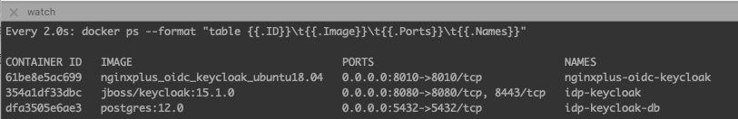

# How To Set Up and Locally Test NGINX Plus OIDC

This is to provide how to set up IdP, NGINX Plus and locally test OIDC flow in your machine before implementing your frontend and backend application.

> Note: The main [`README.md`](https://github.com/nginxinc/nginx-openid-connect) of this repo explains several options in detail. But this doc focuses on `Quick Start Guide` to quickly set up and test the OIDC flow locally using bundled frontend app and backend environment.


- [1. Prerequisites](#1-prerequisites)
- [2. Running a Docker Container](#2-running-a-docker-container)
- [3. Running a Browser and Checking If Bundle Page Works](#3-running-a-browser-and-checking-if-bundle-page-works)
- [4. Setting up an Identity Provider (IdP)](#4-setting-up-an-identity-provider-idp)
- [5. Configuring NGINX Plus](#5-configuring-nginx-plus)
- [6. Testing NGINX Plus OIDC](#6-testing-nginx-plus-oidc)
- [7. Stop and Remove Docker Containers](#7-stop-and-remove-docker-containers)

## 1. Prerequisites

- [Install and Run Docker](https://docs.docker.com/engine/install/) in your local machine.

- Edit `hosts` file in your laptop via if you want to locally test NGINX Plus OIDC:

  ```bash
  $ sudo vi /etc/hosts or notepad.exe c:\Windows\System32\Drivers\etc\hosts

  127.0.0.1 www.example.com
  127.0.0.1 host.docker.internal
  ```

  > Note: In this example, **Keycloak** is used as it can be installed as one of Docker containers in your local machine.

- [Download NGINX Plus license files](https://www.nginx.com/free-trial-request/), and copy them to ./docker/build-context/ssl/

  ```bash
  nginx-repo.crt
  nginx-repo.key
  ```

- Clone the [nginx-openid-connect/nginx-oidc-examples](https://github.com/nginx-openid-connect/nginx-oidc-examples.git) GitHub repository, or download the repo files.

  ```bash
  git clone https://github.com/nginx-openid-connect/nginx-oidc-examples.git
  ```

- Change the working directory.

  ```bash
  cd nginx-oidc-examples/001-oidc-local-test
  ```

## 2. Running a Docker Container

- Start a Docker container:

  ```bash
  $ make start
  ```

  > Note:
  >
  > - In this example, a Keycloak container image (`jboss/keycloak:15.1.0`) is used.
  > - Please try another version of Keycloak container images in [`docker-compose.yml`](../docker-compose.yml) if you have any issue when starting it in your local machine.

  <br>

- Check Docker container's status:

  ```bash
  $ make watch
  ```

  

## 3. Running a Browser and Checking If Bundle Page Works

- Run a Web Browser with `http://www.example.com:8010/`, and check if the bundle frontend landing page is shown:

  

## 4. Setting up an Identity Provider (IdP)

Choose one of your prefered IdPs, and set up your IdP by referencing the following guides:

- [Create and configure an app in Amazon Cognito](https://github.com/nginx-openid-connect/nginx-oidc-amazon-cognito/blob/main/docs/01-IdP-Setup.md)
- [Create and configure an app in Auto0](https://github.com/nginx-openid-connect/nginx-oidc-auth0/blob/main/docs/01-Auth0-Setup.md)
- [Create and configure an app in Azure AD](https://github.com/nginx-openid-connect/nginx-oidc-azure-ad/blob/main/docs/01-IdP-Setup.md)
- [Create and configure an app in Keycloak](https://github.com/nginx-openid-connect/nginx-oidc-keycloak/blob/main/docs/01-IdP-Setup.md)
- [Create and configure an app in Okta](https://github.com/nginx-openid-connect/nginx-oidc-okta/blob/main/docs/01-IdP-Setup.md)
- [Create and configure an app in OneLogin](https://github.com/nginx-openid-connect/nginx-oidc-onelogin/blob/main/docs/01-IdP-Setup.md)
- [Create and configure an app in Ping Identity](https://github.com/nginx-openid-connect/nginx-oidc-ping-identity/blob/main/docs/01-IdP-Setup.md)

> Notes:
>
> - In this example, **Keycloak** is used as it can be installed as one of Docker containers in your local machine.
>   - **Client ID**: `my-client-id`
>   - **Access Type**: `public` for PKCE
>   - **Valid Redirected URIs**:
>     - `http://www.example.com:8010/_codexch`
>     - `http://www.example.com:8010/_logout`
> - The above references will be eventually consolidated into the [NGINX Docs](https://docs.nginx.com/nginx/deployment-guides/single-sign-on/). So feel free to contribute the repo to make better examples for each IdP as references.

## 5. Configuring NGINX Plus

Update the NGINX Plus configuration file if you want. Otherwise, skip the following steps for your quick test as the minimal config information is already provided in this repo.

- In the `openid_connect_configuration.conf`, find and update `$oidc_authz_endpoint`, `$oidc_token_endpoint`, `$oidc_jwt_keyfile`, `$oidc_logout_endpoint`, `$oidc_userinfo_endpoint`, `$oidc_client`, `$oidc_pkce_enable`, `$oidc_client_secret`, and `$oidc_scopes` upon your setup in IdP.

  ```nginx
    map $host $oidc_authz_endpoint {
        default "http://host.docker.internal:8080/auth/realms/master/protocol/openid-connect/auth";
    }

    map $host $oidc_token_endpoint {
        default "http://host.docker.internal:8080/auth/realms/master/protocol/openid-connect/token";
    }

    map $host $oidc_jwt_keyfile {
        default "http://host.docker.internal:8080/auth/realms/master/protocol/openid-connect/certs";
    }

    map $host $oidc_logout_endpoint {
        default "http://host.docker.internal:8080/auth/realms/master/protocol/openid-connect/logout";
    }

    map $host $oidc_userinfo_endpoint {
        default "http://host.docker.internal:8080/auth/realms/master/protocol/openid-connect/userinfo";
    }

    map $host $oidc_client {
        default "my-client-id";
    }

    map $host $oidc_pkce_enable {
        default 1;
    }

    map $host $oidc_client_secret {
        default "my-client-secret";
    }

    map $host $oidc_scopes {
        default "openid+profile+email+offline_access";
    }

    map $host $oidc_landing_page {
        # Where to send browser after successful login. This option is only
        # recommended for scenarios where a landing page shows default information
        # without login, and the RP redirects to the landing page after successful
        # login from the OP. If this is empty, then the RP redirects to $request_uri.
        default "";
        www.example.com $redirect_base;
    }

    map $host $post_logout_return_uri {
        # Where to send browser after the RP requests /logout to the OP, and after
        # the RP (/_logout) is called by the OP and cleans cookies. The following
        # If this is empty, then the RP redirects to $request_uri.

        default "";

        # Edit if you want to redirect to the landing page
        www.example.com $oidc_landing_page;

        # Edit if you want to redirect to a custom logout page
        #www.example.com $redirect_base/signout;

        # Edit if you want to redirect to an another complete URL
        #www.example.com https://www.nginx.com;
    }
  ```

- In the `openid_connect.server_conf`, find the directive of `$resolver` and update it,

  ```bash
  resolver 127.0.0.11; # For local Docker DNS lookup
           #  8.8.8.8; # For global DNS lookup of IDP endpoint
  ```

- Restart the instance of NGINX Plus

  ```bash
  docker exec -it nginxplus-oidc-keycloak bash
  nginx -t
  nginx -s reload
  ```

## 6. Testing NGINX Plus OIDC

- Click `Sign In` button:

  

  

- Click `Call a Sample Proxied API` button:

  

  > Note:
  >
  > - In the [`frontend.conf`](../frontend.conf), you can add additional API endpoints like:
  >
  >   ```nginx
  >   location /v1/private-api {
  >       auth_jwt "" token=$access_token;      # Use $session_jwt for Azure AD
  >       auth_jwt_key_request /_jwks_uri;      # Enable when using URL
  >
  >       proxy_set_header Authorization "Bearer $access_token";
  >       proxy_pass http://my_backend;
  >   }
  >   ```
  >
  > - So you can enter a different URI for testing your additional API endpoints via this bundled frontend tool.

- Click `Sign Out` button:

  - Redirect to the original landing page if you configure `$post_logout_return_uri` with `$oidc_landing_page` as the following example:

    ```nginx
    map $host $oidc_landing_page {
        default "";
        www.example.com $redirect_base;
    }

    map $host $post_logout_return_uri {
      default "";
      www.example.com $oidc_landing_page;
    }
    ```

    

  - Redirect to the custom logout page if you configure `$post_logout_return_uri` with `$redirect_base/signout` such as a custom URI as the following example:

    ```nginx
    map $host $post_logout_return_uri {
        default $redirect_base/signout;
    }
    ```

    

## 7. Stop and Remove Docker Containers

- Stop Docker containers

  ```bash
  $ make down
  ```

- Remove Docker container images

  ```bash
  $ make clean
  ```
